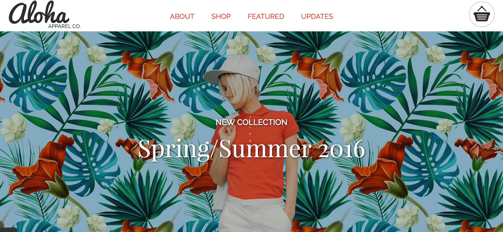

# Project 1: Aloha Apparel Co.

## Description
This sample one-page website was coded from scratch using a provided design outline.

It was built using responsive web design and optimized for 3 widths: mobile, min-width: 600px, and min-width 1240px.

## Technologies Used

- Autoprefixer CSS online (https://autoprefixer.github.io/)
- Flickity (http://flickity.metafizzy.co/)
- Font Awesome (http://fontawesome.io/)
- Font Squirrel (https://www.fontsquirrel.com/)
- GIT
- Google Chrome
- Google Chrome Developer Tools
- JQuery (https://jquery.com/)
- Pesticide for Chrome (Chrome Extension)
- W3C CSS Validation Service (https://jigsaw.w3.org/css-validator/)
- W3C HTML Checker (https://validator.w3.org/nu/)

## Lessons Learned
This project allowed me to utilize HTML, CSS and JavaScript to develop a website and expand my knowledge in the following ways:

- The process of refactoring and reworking my code to build a responsive website helped me understand the different properties one has to consider when using a mobile-first approach.
- One of my major challenges was understanding Flexbox and learning how the various properties work. There was a lot of trial and error involved, but it was helpful in allowing me to visualize how the different properties worked.
- I found the developer tools extremely useful when searching for bugs and finding ways to solve my problem. It quickly became a good friend, guiding me to insights I had not considered before and allowing me to test new ideas before inserting them into my code.